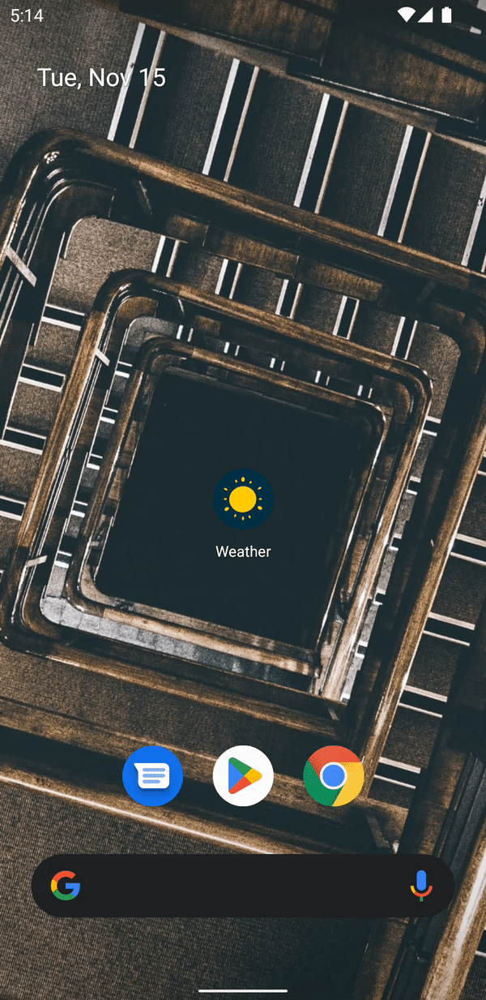
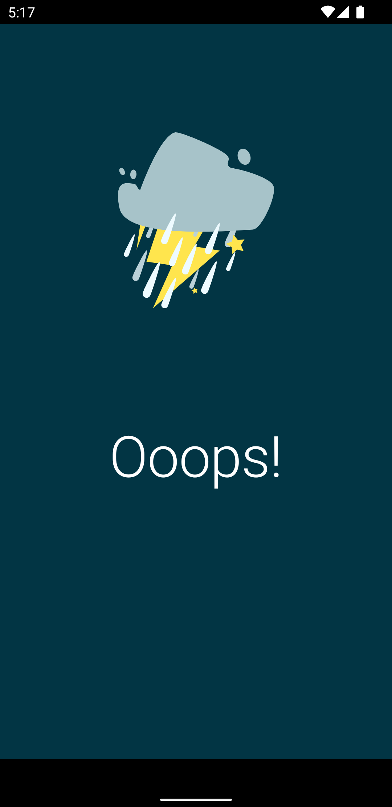

  

# Weather

|||                                 |
|---|---|---------------------------------------|
|||  |

### Tech
* Clean Architecture
* Railway Oriented Programming
* Compose
* Hilt
* Coroutines
* Retrofit
* Lottie
* Light/Dark Theme

### API
* <a href="http://developers.teleport.org/">Teleport</a>

* <a href="https://open-meteo.com/en/docs">Open Meteo</a>

### Attributions

* App & Error icons: <a href="https://www.vecteezy.com/members/itsmax">Max Tarkhov</a>

* Lottie weather animation: <a href="https://lottiefiles.com/ArtRomanov">ArtRomanov</a>

### License

[Apache License, Version 2.0][1]

[1]: http://www.apache.org/licenses/LICENSE-2.0